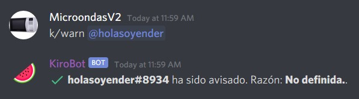
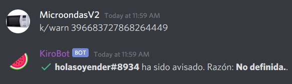

# Información basica

### Prefix \(Prefijo\)

Los comandos del KiroBot se utilizan con el prefijo que configures en el archivo. El prefijo por defecto es **k/,** por lo tanto para usar un comando primero deberás escribir primero el prefijo y luego el comando. Ejemplo: "k/mute "

### Configurar el bot

Para empezar a usar a **deKiro**, se recomienda configurar su archivo de configuración:  
 - `k/exportar`, para conseguir el archivo de configuración. Para aprender a configurarlo ve a [esta pagina.](configuracion.md)  
 - `k/importar`, para importar el archivo que has configurado.

### Campos opcionales y obligatorios

En el apartado _comandos_ verás que para usarlos se necesita rellenar cierta información. Por ejemplo para usar `k/kick` necesitamos llaves { } y corchetes \[ \]

Las llaves \( { } \) significan el campo es **obligatorio** y los corchetes \( \[ \] \) significa que el campo es **opcional**.

Por ejemplo:

`k/kick {usuario} [razón]`

**Usuario** será un campo _obligatorio_ y **Razón** no lo será, en este caso si se deja vacio el campo \[`razón`\], la Razón será **No definida**.  

### Campo {Usuario}

Todos los comandos admiten el uso de ID de usuario y mención en el campo de **Usuario**   
  
Ejemplos: 

### Campo {Duración}

Algunos comandos necesitan especificar duración, puedes usar segundos \(s\), minutos \(m\), horas \(h\) o días \(d\). 

Ejemplo:

k/recordar 10m beber agua

